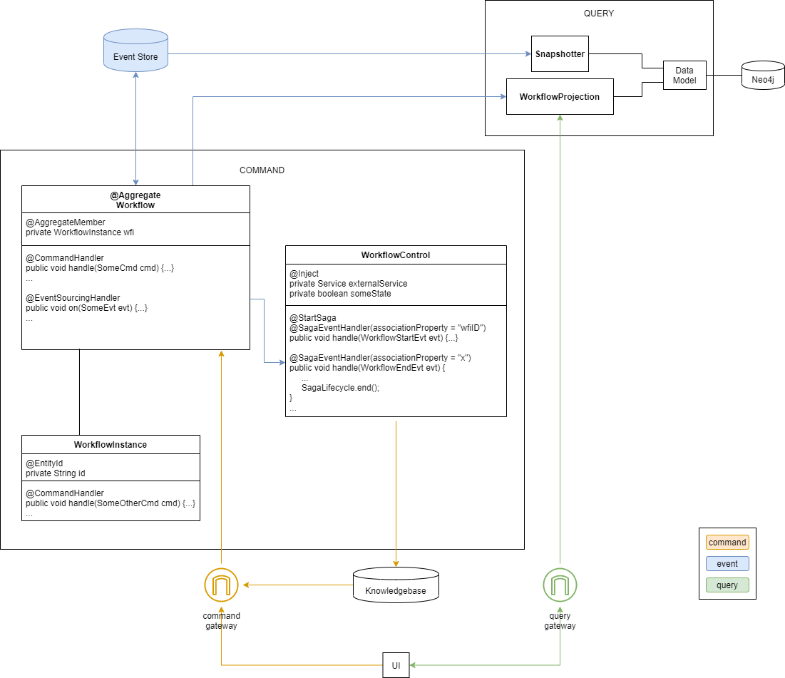

# Impact-Assessment-Application with Axon

Use Axons CQRS-architecture and event sourcing to be able to get old states of the process.

## Command Model
An aggregate manages a worflow model, which consists of a workflow-instance, a workflow-definition, workflow-tasks, quality-assurance-documents and many more artifacts. The workflow model is already given and illustrated only schematically.

The user initiates changes to the state of the workflow model by sending commands to the aggregate. This can happen for example via a user interface or via the result of a rule in the knoledge base. These commands trigger events, that cause the change of the aggregate and are stored in the event-store. From this events the current state of an aggregate can be recreated.

## Query Model
The workflow-projection receives these state update events and projects the changes onto the view model. Additionally the snapshotter can open new event streams of the event store until a given point in time, to recreate a state from the past.
A user can access the view model via queries to the projection.

## Architecture

