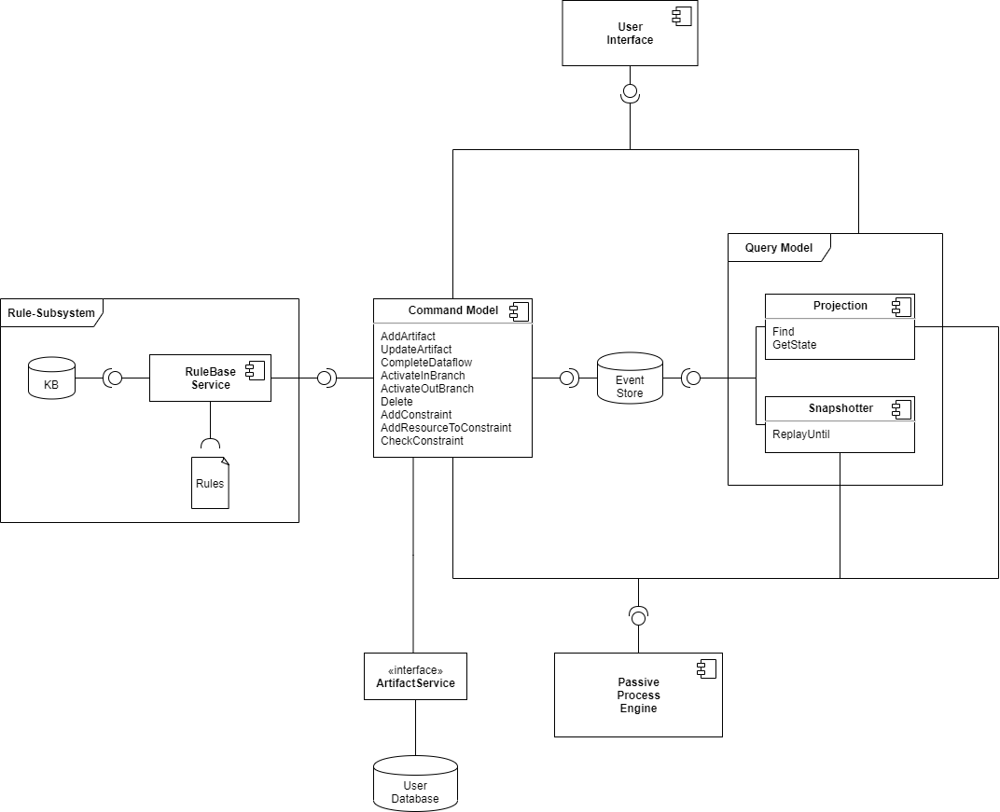
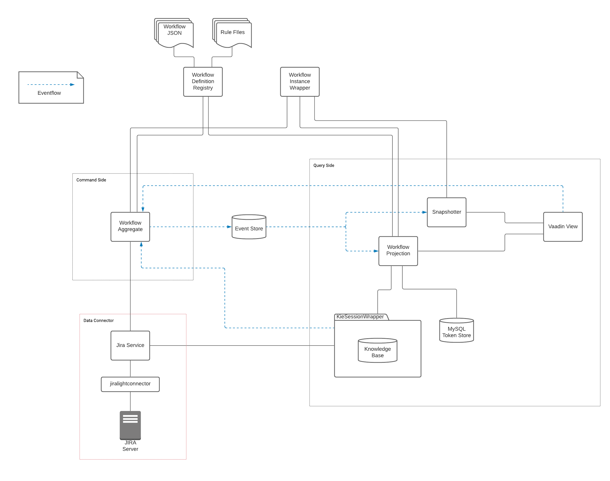
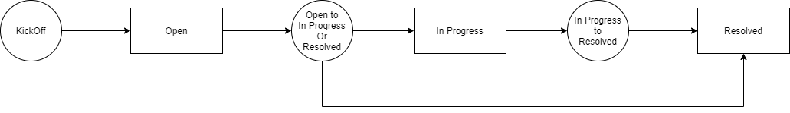

# Quality Assurance Application for Traceable Software Development Artifacts

The foundation for this project is a quality-assurance-process support app, which facilitates [Drools](https://www.drools.org/) as business rules management system in order to check process constraints on artifacts of traceability information systems, like [Jira](https://www.atlassian.com/de/software/jira).

The new aspect added in this work is the ability to get the process state of the past.
To provide this information an event-sourcing framework named [Axon](https://axoniq.io/) is used.
Axon comes with the CQRS pattern (Command Query Responsibility Segregation) of Domain-Driven Design.

## Command Model
In this application an aggregate manages the workflow state, which consists of a workflow-instance, a workflow-definition, workflow-tasks, quality-assurance-documents and many more artifacts. The workflow model is incooperated in the Passive-Process-Engine, which is a subsystem that was reused from the predecessor application.

The user initiates changes to the state of the workflow model by sending commands to the aggregate. This can happen for example via a user interface or via the result of a rule in the knowledge base. These commands trigger events, that cause the change of the aggregate and are stored in the event-store. From this events the current state of an aggregate can be recreated.

## Query Model
The workflow-projection receives these state update events and projects the changes onto the view model. Additionally the snapshotter can open new event streams of the event store until a given point in time, to recreate a state from the past.
A user can access the view model via queries to the projection.

## Architecture
### Components

### Event-Flow
Stronger focus which events/commands/querys are sent between the components.

## Workflow
Throughout development and testing the following workflow for issues (in this case Jira isues) was used:

Rectangles represent the different states an issue can have, namely "Open", "In Progress" and "Resolved".
The circles represent decision-nodes, that simply decides if the issue can enter the next process state. In our case this can be decided simply because of the "status" field of the issue, but it could be more sophisticated requirements or even multiple workflow-tasks that need to fulfill some conditions together.

